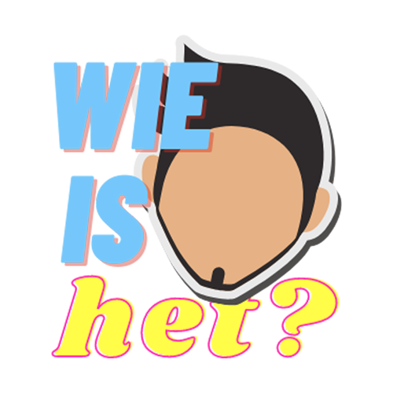

<div align="center">



#### Wie is het? | Guess Who?

[](https://github.com/11TStudio/GuessWho/graphs/contributors)
[](https://github.com/11TStudio/GuessWho/blob/master/LICENSE)

<br>

[](https://github.com/11TStudio/GuessWho/issues)
[](https://github.com/11TStudio/GuessWho/pulls)
[](https://github.com/11TStudio/GuessWho/stargazers)

<br><br>

</div>

### About

This school project was made by LeventHAN.
The main reason behind the project is to learn the MVP-pattern and JavaFX.
You can open an issue ticket at [GitHub Issues](https://github.com/11TStudio/GuessWho/issues) and I wil try to help you out.

You can check out the docs about this project here; [Docs for Guess Who](https://11tstudio.github.io/GuessWho/) 

### Prerequisites

- Git
- JavaFX SDK v11.0.2 (recommended)
- Knowledge of the language Dutch, since this game is written and documented in NL/BE

### Installation and Usage

1. Clone the repository via your terminal/cmd: `git clone https://github.com/11TStudio/GuessWho`
2. Go to your project structure and add JavaFX SDK (11.0.2) in your global libraries.
3. Run `Main` if you get error run `MainHack`
4. Enjoy?

### Disclaimer

The game is not finished 100%.
Look at the [GitHub Issues](https://github.com/11TStudio/GuessWho/issues)

### License

<sup><sub> In case you are looking to use this game in your school project, your teacher/prof can use github/google too :) </sup></sub>
```
MIT License

Copyright (c) 2021 11T Studio

Permission is hereby granted, free of charge, to any person obtaining a copy
of this software and associated documentation files (the "Software"), to deal
in the Software without restriction, including without limitation the rights
to use, copy, modify, merge, publish, distribute, sublicense, and/or sell
copies of the Software, and to permit persons to whom the Software is
furnished to do so, subject to the following conditions:

The above copyright notice and this permission notice shall be included in all
copies or substantial portions of the Software.

THE SOFTWARE IS PROVIDED "AS IS", WITHOUT WARRANTY OF ANY KIND, EXPRESS OR
IMPLIED, INCLUDING BUT NOT LIMITED TO THE WARRANTIES OF MERCHANTABILITY,
FITNESS FOR A PARTICULAR PURPOSE AND NONINFRINGEMENT. IN NO EVENT SHALL THE
AUTHORS OR COPYRIGHT HOLDERS BE LIABLE FOR ANY CLAIM, DAMAGES OR OTHER
LIABILITY, WHETHER IN AN ACTION OF CONTRACT, TORT OR OTHERWISE, ARISING FROM,
OUT OF OR IN CONNECTION WITH THE SOFTWARE OR THE USE OR OTHER DEALINGS IN THE
SOFTWARE.

```
